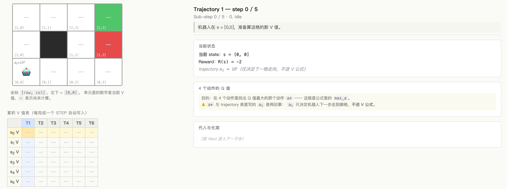

# MDP Value Iteration · Grid World 教学动画

一个交互式网页，把 4×3 grid world 上的 **Value Iteration**（沿 trajectory 的 one-step Bellman backup）一步步可视化，配合 AI 课程作业（week 10 MDP and RL）讲解使用。

## 在线体验

👉 https://cubwb7.github.io/mdp-value-iteration-animation/

## 截图



## 它做什么

- **6 条预设 trajectory**，每条沿着轨迹依次对每个 state 做一次 Bellman 最优更新
- 每一步拆成 6 个子步：`Idle → Q-table → Pick max → Highlight → Substitute → Commit & Move`
- 顶部 Bellman 公式常显，可展开看完整推导（从作业给的 `V*(s) = max_a Σ T·[R + γV*]` 一路推到 `V_new = R(s) + γ·max_a Q(s,a)`）
- Q 值表、a* vs aₜ 区分提示、转移概率角标、累积 V 值表（跨 trajectory）一应俱全

## 关键算法点

```
V_new(s) = R(s) + γ · max_a Σ_{s'} T(s, a, s') · V_old(s')
```

- 公式里的 `a` 是 `max_a`（4 个动作里 Q 最大那个），与 trajectory 表里的 `aₜ` **是两回事** —— `aₜ` 只决定机器人下一步走到哪
- **绿格 (+1) 和红格 (-1) 都是 terminal**：进入即 V = R，无后续转移
- V 表跨 trajectory 累积（T2 起点的 V 表 = T1 跑完后的 V 表）

详细解题说明见 [SOLUTION.md](SOLUTION.md)。

## 技术栈

- 纯 vanilla **HTML / CSS / JavaScript**，无构建工具
- [KaTeX](https://katex.org/) (CDN) 渲染公式
- CSS Grid 画 4×3 棋盘

## 本地运行

```bash
git clone https://github.com/CUBWB7/mdp-value-iteration-animation.git
cd mdp-value-iteration-animation
open index.html      # macOS
# 或者直接双击 index.html
```

## 文件结构

```
.
├── index.html       页面骨架
├── style.css        棋盘 / 面板 / 高亮 / 控件
├── data.js          Grid 拓扑 + 6 条 trajectory 数据
├── script.js        状态机 + Bellman 计算 + 渲染
└── SOLUTION.md      作业解题详细说明
```

## 控件

| 操作 | 说明 |
|---|---|
| `Reset` | 回到当前 trajectory 起点 |
| `Prev` / `Next` | 上 / 下一个子步 |
| `Play` | 自动推进 |
| `Speed` | 自动播放速度 |
| `← →` | 翻页 |
| `Space` | 切换播放/暂停 |
| `Trajectory 1–6` | 切换轨迹 |

## License

MIT
